  

<h1 align="center">Fatima Afzal</h1>

  Software Developer · Building thoughtful, useful digital products

  
  

---

## About

I’m a developer focused on creating reliable, well-considered software. My work spans full-stack web applications, AI-powered productivity tools, and desktop systems—always with an emphasis on clear user experiences and practical outcomes.

## Featured projects

  

  
  

  
  

  
  

  Full-stack platforms · AI-powered tools · Privacy-conscious applications

## Core toolkit

  

  TypeScript · JavaScript · Python · React · Next.js · PostgreSQL · SQLite · Tailwind CSS

## Contribution trail

  

## Let’s connect

I’m open to meaningful opportunities and collaborations. Reach me on [LinkedIn](https://www.linkedin.com/in/fatima-afzal-99b221288/) or use the **Email Fatima** button above. You can also copy my email: [afzalfatima055@gmail.com](mailto:afzalfatima055@gmail.com).
